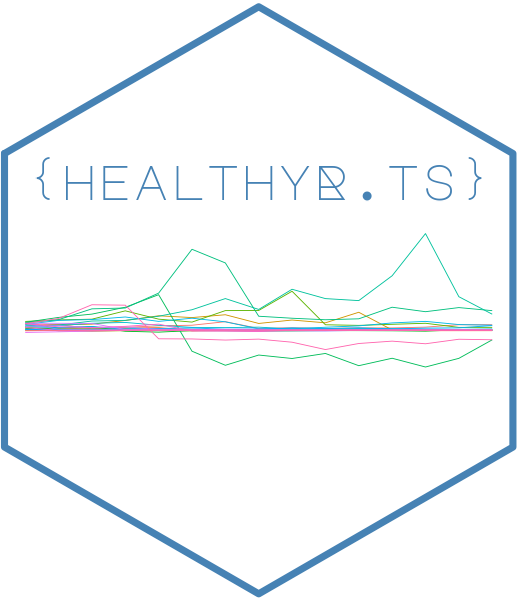
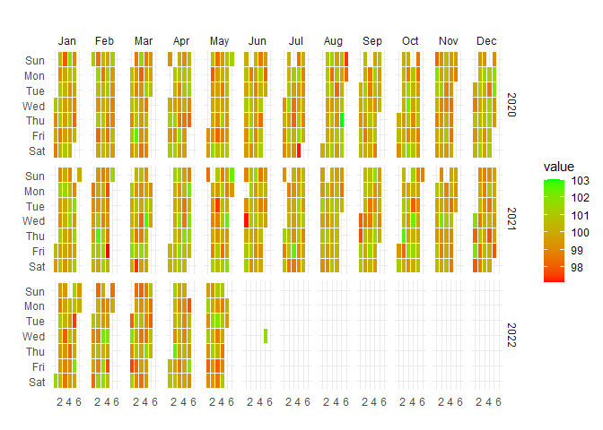
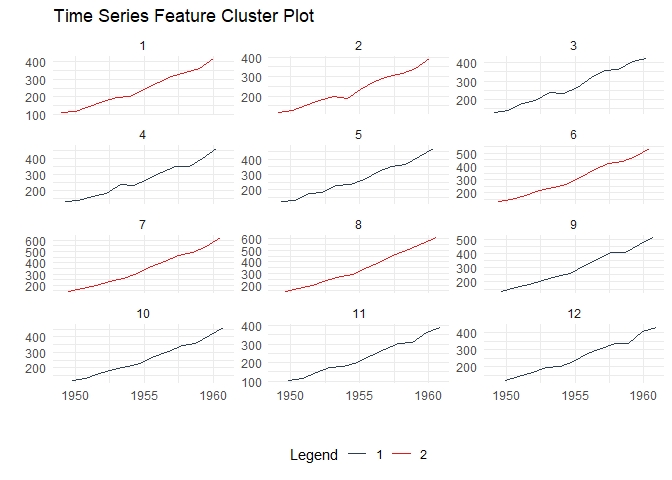
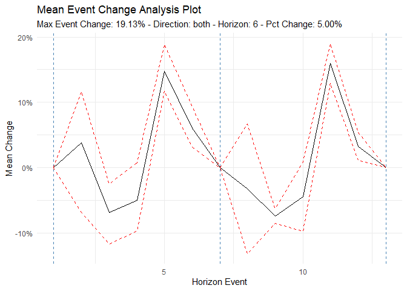
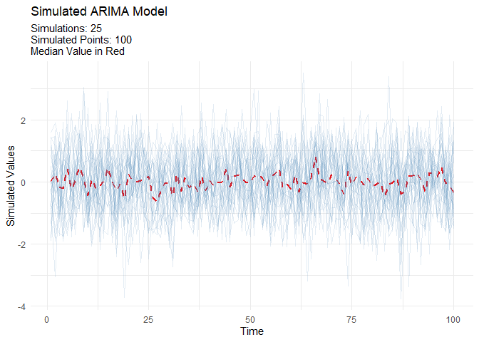

<!-- README.md is generated from README.Rmd. Please edit that file -->

# healthyR.ts 

<!-- badges: start -->
[](https://cran.r-project.org/package=healthyR.ts)


[](https://lifecycle.r-lib.org/articles/stages.html#experimental)
[](https://makeapullrequest.com/)
<!-- badges: end -->

> **The Time Series Modeling Companion to healthyR**

`healthyR.ts` is a comprehensive R package designed specifically for time series analysis and forecasting of hospital administrative and clinical data. Built on the powerful [tidymodels](https://www.tidymodels.org/) ecosystem, it provides a consistent, user-friendly framework that simplifies complex time series workflows.

## Why healthyR.ts?

Hospital data analysis often requires handling time series for metrics like:
- Average Length of Stay (ALOS)
- Readmission rates
- Patient volumes and admissions
- Bed occupancy rates
- Clinical outcomes over time

`healthyR.ts` takes the guesswork out of time series analysis by providing:

✅ **Automated Workflows** - One-function solutions for complete modeling pipelines  
✅ **Visual Analytics** - Rich plotting functions for data exploration  
✅ **Data Generators** - Simulate realistic time series for testing and validation  
✅ **Statistical Tools** - Comprehensive suite of time series statistics  
✅ **Clustering** - Feature-based time series clustering capabilities  
✅ **Forecasting** - 15+ automated model workflows (ARIMA, Prophet, XGBoost, and more)

## Key Features

### 🤖 Automatic Modeling Workflows

Complete end-to-end modeling pipelines in a single function call:

- **ts_auto_arima()** - Automatic ARIMA modeling
- **ts_auto_prophet_reg()** - Facebook's Prophet algorithm
- **ts_auto_xgboost()** - Gradient boosting for time series
- **ts_auto_nnetar()** - Neural network autoregression
- Plus 11 more automated workflows!

Each function handles recipe creation, model specification, workflow setup, model fitting, tuning, and calibration automatically.

### 📊 Visualization Suite

- Calendar heatmaps for temporal patterns
- Time series clustering plots
- Velocity, acceleration, and growth visualizations
- QQ plots and scedasticity analysis
- Moving average and SMA plots
- Event analysis visualizations

### 🎲 Data Generation

Generate synthetic time series data for testing:
- Random walks and Brownian motion
- Geometric Brownian motion
- ARIMA simulations
- Custom parameter configurations

### 📈 Statistical Analysis

- ADF stationarity tests
- Fast Fourier Transform (FFT) analysis
- Confidence intervals
- Lag correlation analysis
- Time series feature extraction

## Installation

### Stable Release (CRAN)

Install the latest stable version from [CRAN](https://CRAN.R-project.org):

``` r
install.packages("healthyR.ts")
```

### Development Version

Get the latest features and bug fixes from [GitHub](https://github.com/spsanderson/healthyR.ts):

``` r
# install.packages("devtools")
devtools::install_github("spsanderson/healthyR.ts")
```

## Quick Start

### Basic Example: Random Walk Simulation

Generate and visualize random walk data to understand market volatility or patient flow variations:

``` r
library(healthyR.ts)
library(ggplot2)

df <- ts_random_walk()

head(df)
#> # A tibble: 6 × 4
#>     run     x        y cum_y
#>   <dbl> <dbl>    <dbl> <dbl>
#> 1     1     1 0.0521   1052.
#> 2     1     2 0.000486 1053.
#> 3     1     3 0.0567   1112.
#> 4     1     4 0.125    1252.
#> 5     1     5 0.0825   1355.
#> 6     1     6 0.00340  1360.
```

Now that the data has been generated, lets take a look at it.

``` r
df %>%
   ggplot(
       mapping = aes(
           x = x
           , y = cum_y
           , color = factor(run)
           , group = factor(run)
        )
    ) +
    geom_line(alpha = 0.8) +
    ts_random_walk_ggplot_layers(df)
```


That is still pretty noisy, so lets see this in a different way. Lets
clear this up a bit to make it easier to see the full range of the
possible volatility of the random walks.

``` r
library(dplyr)
library(ggplot2)

df %>%
    group_by(x) %>%
    summarise(
        min_y = min(cum_y),
        max_y = max(cum_y)
    ) %>%
    ggplot(
        aes(x = x)
    ) +
    geom_line(aes(y = max_y), color = "steelblue") +
    geom_line(aes(y = min_y), color = "firebrick") +
    geom_ribbon(aes(ymin = min_y, ymax = max_y), alpha = 0.2) +
    ts_random_walk_ggplot_layers(df)
```


### Calendar Heatmap Visualization

Visualize temporal patterns in your data with calendar heatmaps - perfect for identifying seasonal trends or unusual patterns in hospital metrics:

``` r
data_tbl <- data.frame(
  date_col = seq.Date(
    from = as.Date("2020-01-01"),
    to   = as.Date("2022-06-01"),
    length.out = 365*2 + 180
    ),
  value = rnorm(365*2+180, mean = 100)
)

ts_calendar_heatmap_plot(
  .data          = data_tbl
  , .date_col    = date_col
  , .value_col   = value
  , .interactive = FALSE
)
```



### Time Series Clustering

Discover patterns by clustering time series based on their statistical features:

``` r
data_tbl <- ts_to_tbl(AirPassengers) %>%
  mutate(group_id = rep(1:12, 12))

output <- ts_feature_cluster(
  .data = data_tbl,
  .date_col = date_col,
  .value_col = value,
  group_id,
  .features = c("acf_features","entropy"),
  .scale = TRUE,
  .prefix = "ts_",
  .centers = 3
)

ts_feature_cluster_plot(
  .data = output,
  .date_col = date_col,
  .value_col = value,
  .center = 2,
  group_id
)
```



### Event Analysis

Analyze time series behavior before and after significant events (e.g., policy changes, new treatments):

``` r
library(dplyr)
df <- ts_to_tbl(AirPassengers) %>% select(-index)

ts_time_event_analysis_tbl(
  .data = df,
  .horizon = 6,
  .date_col = date_col,
  .value_col = value,
  .direction = "both"
) %>%
  ts_event_analysis_plot()
```



``` r
ts_time_event_analysis_tbl(
  .data = df,
  .horizon = 6,
  .date_col = date_col,
  .value_col = value,
  .direction = "both"
) %>%
  ts_event_analysis_plot(.plot_type = "individual")
```


### ARIMA Simulation

Generate realistic ARIMA time series for testing and validation:

``` r
output <- ts_arima_simulator()
output$plots$static_plot
```



## Available Models

### Automated Workflow Functions

Each function creates a complete modeling pipeline including recipe, model specification, workflow, fitting, and calibration:

| Function | Model Type | Description |
|----------|------------|-------------|
| `ts_auto_arima()` | ARIMA | Automatic ARIMA with auto-tuning |
| `ts_auto_arima_xgboost()` | Hybrid | ARIMA errors with XGBoost |
| `ts_auto_prophet_reg()` | Prophet | Facebook's Prophet algorithm |
| `ts_auto_prophet_boost()` | Hybrid | Prophet with XGBoost |
| `ts_auto_xgboost()` | ML | Gradient boosting |
| `ts_auto_nnetar()` | Neural Net | Neural network autoregression |
| `ts_auto_exp_smoothing()` | ETS | Exponential smoothing |
| `ts_auto_smooth_es()` | Smooth | Smooth package ETS |
| `ts_auto_theta()` | Theta | Theta method |
| `ts_auto_croston()` | Croston | For intermittent demand |
| `ts_auto_lm()` | Linear | Linear regression with time features |
| `ts_auto_mars()` | MARS | Multivariate adaptive regression splines |
| `ts_auto_glmnet()` | GLM | Elastic net regression |
| `ts_auto_svm_poly()` | SVM | Support vector machine (polynomial) |
| `ts_auto_svm_rbf()` | SVM | Support vector machine (radial) |

## Function Categories

`healthyR.ts` includes 85+ functions organized into these categories:

- **📊 Data Generators**: Create synthetic time series data (random walks, Brownian motion, ARIMA)
- **📈 Plotting Functions**: Comprehensive visualization suite for time series
- **🔍 Clustering**: Feature-based time series clustering and analysis
- **🤖 Forecasting**: Automated modeling workflows and model comparison
- **📐 Statistical Functions**: Tests, transformations, and time series statistics
- **🔧 Utilities**: Helper functions for data manipulation and transformation
- **📉 Augment Functions**: Add features like velocity, acceleration, and growth rates
- **🧮 Vector Functions**: Vectorized operations for time series
- **🔬 Recipe Steps**: Custom tidymodels recipe steps for time series

## Documentation

- 📘 [**Getting Started Vignette**](https://www.spsanderson.com/healthyR.ts/articles/getting-started.html) - Comprehensive introduction
- 📗 [**Function Reference**](https://www.spsanderson.com/healthyR.ts/reference/index.html) - Complete function documentation
- 📙 [**Package Website**](https://www.spsanderson.com/healthyR.ts/) - Full documentation site
- 📕 [**News/Changelog**](https://www.spsanderson.com/healthyR.ts/news/index.html) - Version history and updates

## Learning Resources

### Vignettes

- [Getting Started with healthyR.ts](https://www.spsanderson.com/healthyR.ts/articles/getting-started.html)
- [Using Tidy FFT](https://www.spsanderson.com/healthyR.ts/articles/using-tidy-fft.html)

### Example Use Cases

1. **Hospital Admissions Forecasting** - Predict daily/weekly admissions using multiple models
2. **Length of Stay Analysis** - Analyze and forecast ALOS trends
3. **Readmission Rate Monitoring** - Track and predict readmission patterns
4. **Resource Planning** - Forecast bed occupancy and staffing needs
5. **Seasonal Pattern Detection** - Identify and visualize seasonal trends in clinical data

## Contributing

Contributions are welcome! Here's how you can help:

- 🐛 **Report bugs** via [GitHub Issues](https://github.com/spsanderson/healthyR.ts/issues)
- 💡 **Suggest features** through issue requests
- 🔧 **Submit pull requests** for bug fixes or new features
- 📖 **Improve documentation** by suggesting clarifications or additions

Please follow the [tidyverse style guide](https://style.tidyverse.org/) for code contributions.

## Related Packages

- [**healthyR**](https://www.spsanderson.com/healthyR/) - Hospital data analysis companion package
- [**healthyR.ai**](https://www.spsanderson.com/healthyR.ai/) - Machine learning companion for healthcare
- [**healthyverse**](https://www.spsanderson.com/healthyverse/) - Meta-package loading all healthyR packages

## Citation

If you use `healthyR.ts` in your research or publications, please cite:

```r
citation("healthyR.ts")
```

## Support

- 📧 **Email**: spsanderson@gmail.com
- 🐦 **Issues**: [GitHub Issue Tracker](https://github.com/spsanderson/healthyR.ts/issues)
- 🌐 **Website**: https://www.spsanderson.com/healthyR.ts/

## License

MIT License - see [LICENSE](LICENSE.md) for details

---

**Author**: Steven P. Sanderson II, MPH  
**Maintainer**: Steven P. Sanderson II, MPH (spsanderson@gmail.com)  
**Copyright**: © 2024 Steven P. Sanderson II, MPH
