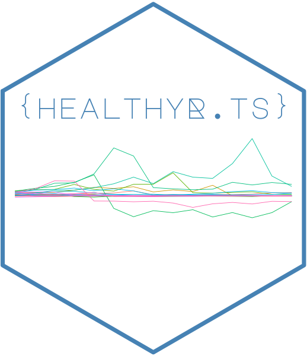
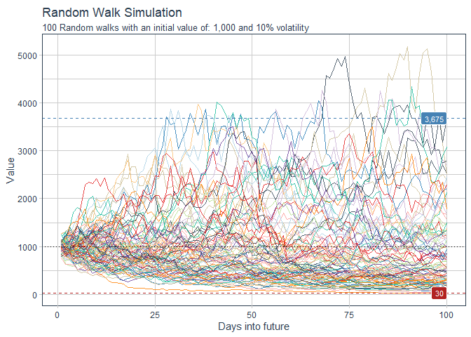
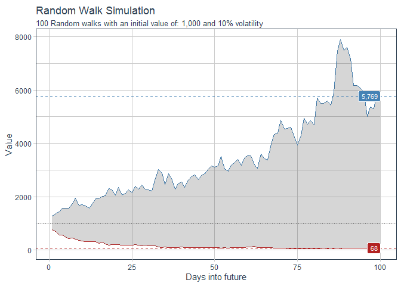

<!-- README.md is generated from README.Rmd. Please edit that file -->

# healthyR.ts 

<!-- badges: start -->

[](https://cran.r-project.org/package=healthyR.ts)


[](https://lifecycle.r-lib.org/articles/stages.html#experimental)
[](https://makeapullrequest.com/)
<!-- badges: end -->

The goal of `healthyR.ts` is to provide a consistent verb framework for
performing time series analysis and forecasting on both administrative
and clinical hospital data.

## Installation

You can install the released version of healthyR.ts from
[CRAN](https://CRAN.R-project.org) with:

``` r
install.packages("healthyR.ts")
```

And the development version from [GitHub](https://github.com/) with:

``` r
# install.packages("devtools")
devtools::install_github("spsanderson/healthyR.ts")
```

## Example

This is a basic example which shows you how to generate random walk
data.

``` r
library(healthyR.ts)
library(ggplot2)

df <- ts_random_walk()

head(df)
#> # A tibble: 6 x 4
#>     run     x        y cum_y
#>   <dbl> <dbl>    <dbl> <dbl>
#> 1     1     1  0.195   1195.
#> 2     1     2  0.0547  1261.
#> 3     1     3 -0.0471  1201.
#> 4     1     4 -0.00551 1195.
#> 5     1     5  0.285   1536.
#> 6     1     6  0.0248  1574.
```

Now that the data has been generated, lets take a look at it.

``` r
df %>%
   ggplot(
       mapping = aes(
           x = x
           , y = cum_y
           , color = factor(run)
           , group = factor(run)
        )
    ) +
    geom_line(alpha = 0.8) +
    ts_random_walk_ggplot_layers(df)
```



That is still pretty noisy, so lets see this in a different way. Lets
clear this up a bit to make it easier to see the full range of the
possible volatility of the random walks.

``` r
library(dplyr)
library(ggplot2)

df %>%
    group_by(x) %>%
    summarise(
        min_y = min(cum_y),
        max_y = max(cum_y)
    ) %>%
    ggplot(
        aes(x = x)
    ) +
    geom_line(aes(y = max_y), color = "steelblue") +
    geom_line(aes(y = min_y), color = "firebrick") +
    geom_ribbon(aes(ymin = min_y, ymax = max_y), alpha = 0.2) +
    ts_random_walk_ggplot_layers(df)
```


