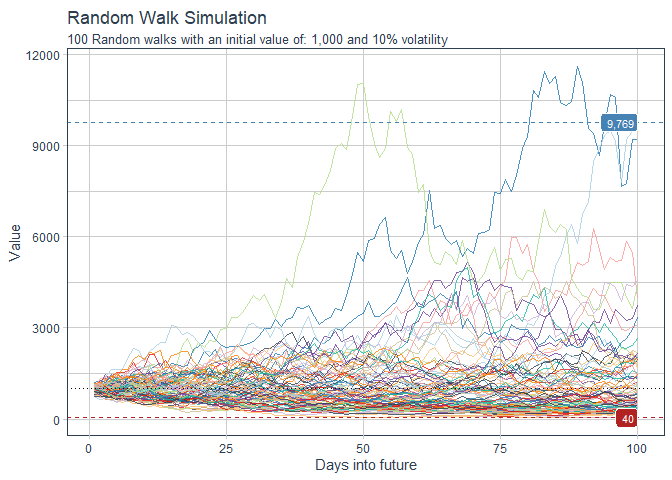

<!-- README.md is generated from README.Rmd. Please edit that file -->

# healthyR.ts 

<!-- badges: start -->

[](https://www.tidyverse.org/lifecycle/#experimental)
<!-- badges: end -->

The goal of `healthyR.ts` is to provide a consistent verb framework for
performing time-series analysis and forecasting.

## Installation

You can install the released version of healthyR.ts from
[CRAN](https://CRAN.R-project.org) with:

``` r
install.packages("healthyR.ts")
```

And the development version from [GitHub](https://github.com/) with:

``` r
# install.packages("devtools")
devtools::install_github("spsanderson/healthyR.ts")
```

## Example

This is a basic example which shows you how to solve a common problem:

``` r
library(healthyR.ts)
library(ggplot2)

df <- ts_random_walk()

df %>%
   ggplot(
       mapping = aes(
           x = x
           , y = cum_y
           , color = factor(run)
           , group = factor(run)
        )
    ) +
    geom_line(alpha = 0.8) +
    get_gg_layers(df)
#> Registered S3 method overwritten by 'quantmod':
#>   method            from
#>   as.zoo.data.frame zoo
```


