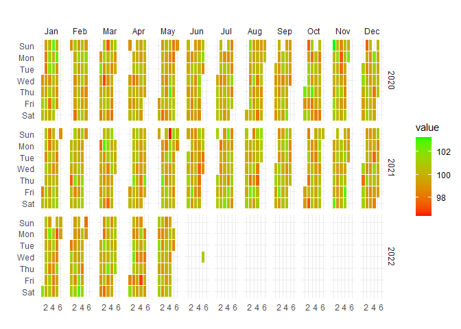

<!-- README.md is generated from README.Rmd. Please edit that file -->

# healthyR.ts 

<!-- badges: start -->

[](https://cran.r-project.org/package=healthyR.ts)


[](https://lifecycle.r-lib.org/articles/stages.html#experimental)
[](https://makeapullrequest.com/)
<!-- badges: end -->

> **The Time Series Modeling Companion to healthyR**

To view the full wiki, click here: [Full healthyR.ts
Wiki](https://github.com/spsanderson/healthyR.ts/blob/master/wiki/Home.md)

`healthyR.ts` is a comprehensive R package designed specifically for
time series analysis and forecasting of hospital administrative and
clinical data. Built on the powerful
[tidymodels](https://www.tidymodels.org/) ecosystem, it provides a
consistent, user-friendly framework that simplifies complex time series
workflows.

## Why healthyR.ts?

Hospital data analysis often requires handling time series for metrics
like: - Average Length of Stay (ALOS) - Readmission rates - Patient
volumes and admissions - Bed occupancy rates - Clinical outcomes over
time

`healthyR.ts` takes the guesswork out of time series analysis by
providing:

✅ **Automated Workflows** - One-function solutions for complete
modeling pipelines  
✅ **Visual Analytics** - Rich plotting functions for data exploration  
✅ **Data Generators** - Simulate realistic time series for testing and
validation  
✅ **Statistical Tools** - Comprehensive suite of time series
statistics  
✅ **Clustering** - Feature-based time series clustering capabilities  
✅ **Forecasting** - 15 automated model workflows (ARIMA, Prophet,
XGBoost, and more)

## Key Features

### 🤖 Automatic Modeling Workflows

Complete end-to-end modeling pipelines in a single function call:

- **ts_auto_arima()** - Automatic ARIMA modeling
- **ts_auto_prophet_reg()** - Facebook’s Prophet algorithm
- **ts_auto_xgboost()** - Gradient boosting for time series
- **ts_auto_nnetar()** - Neural network autoregression
- Plus 11 more specialized workflows!

Each function handles recipe creation, model specification, workflow
setup, model fitting, tuning, and calibration automatically.

### 📊 Visualization Suite

- Calendar heatmaps for temporal patterns
- Time series clustering plots
- Velocity, acceleration, and growth visualizations
- QQ plots and scedasticity analysis
- Moving average and SMA plots
- Event analysis visualizations

### 🎲 Data Generation

Generate synthetic time series data for testing: - Random walks and
Brownian motion - Geometric Brownian motion - ARIMA simulations - Custom
parameter configurations

### 📈 Statistical Analysis

- ADF stationarity tests
- Fast Fourier Transform (FFT) analysis
- Confidence intervals
- Lag correlation analysis
- Time series feature extraction

## Installation

### Stable Release (CRAN)

Install the latest stable version from
[CRAN](https://CRAN.R-project.org):

``` r
install.packages("healthyR.ts")
```

### Development Version

Get the latest features and bug fixes from
[GitHub](https://github.com/spsanderson/healthyR.ts):

``` r
# install.packages("devtools")
devtools::install_github("spsanderson/healthyR.ts")
```

## Quick Start

### Basic Example: Random Walk Simulation

Generate and visualize random walk data to understand market volatility
or patient flow variations:

``` r
library(healthyR.ts)
library(ggplot2)

df <- ts_random_walk()

head(df)
#> # A tibble: 6 × 4
#>     run     x        y cum_y
#>   <dbl> <dbl>    <dbl> <dbl>
#> 1     1     1 -0.00559  994.
#> 2     1     2  0.119   1112.
#> 3     1     3  0.109   1233.
#> 4     1     4  0.0255  1265.
#> 5     1     5 -0.0320  1224.
#> 6     1     6 -0.0397  1176.
```

Now that the data has been generated, lets take a look at it.

``` r
df %>%
   ggplot(
       mapping = aes(
           x = x
           , y = cum_y
           , color = factor(run)
           , group = factor(run)
        )
    ) +
    geom_line(alpha = 0.8) +
    ts_random_walk_ggplot_layers(df)
```


That is still pretty noisy, so lets see this in a different way. Lets
clear this up a bit to make it easier to see the full range of the
possible volatility of the random walks.

``` r
library(dplyr)
library(ggplot2)

df %>%
    group_by(x) %>%
    summarise(
        min_y = min(cum_y),
        max_y = max(cum_y)
    ) %>%
    ggplot(
        aes(x = x)
    ) +
    geom_line(aes(y = max_y), color = "steelblue") +
    geom_line(aes(y = min_y), color = "firebrick") +
    geom_ribbon(aes(ymin = min_y, ymax = max_y), alpha = 0.2) +
    ts_random_walk_ggplot_layers(df)
```


### Calendar Heatmap Visualization

Visualize temporal patterns in your data with calendar heatmaps -
perfect for identifying seasonal trends or unusual patterns in hospital
metrics:

``` r
data_tbl <- data.frame(
  date_col = seq.Date(
    from = as.Date("2020-01-01"),
    to   = as.Date("2022-06-01"),
    length.out = 365*2 + 180
    ),
  value = rnorm(365*2+180, mean = 100)
)

ts_calendar_heatmap_plot(
  .data          = data_tbl
  , .date_col    = date_col
  , .value_col   = value
  , .interactive = FALSE
)
```



### Time Series Clustering

Discover patterns by clustering time series based on their statistical
features:

``` r
data_tbl <- ts_to_tbl(AirPassengers) %>%
  mutate(group_id = rep(1:12, 12))

output <- ts_feature_cluster(
  .data = data_tbl,
  .date_col = date_col,
  .value_col = value,
  group_id,
  .features = c("acf_features","entropy"),
  .scale = TRUE,
  .prefix = "ts_",
  .centers = 3
)

ts_feature_cluster_plot(
  .data = output,
  .date_col = date_col,
  .value_col = value,
  .center = 2,
  group_id
)
```


    #> $plot
    #> $plot$static_plot


    #> 
    #> $plot$plotly_plot
    #> 
    #> 
    #> $data
    #> $data$original_data
    #> # A tibble: 144 × 4
    #>    index     date_col   value group_id
    #>    <yearmon> <date>     <dbl>    <int>
    #>  1 Jan 1949  1949-01-01   112        1
    #>  2 Feb 1949  1949-02-01   118        2
    #>  3 Mar 1949  1949-03-01   132        3
    #>  4 Apr 1949  1949-04-01   129        4
    #>  5 May 1949  1949-05-01   121        5
    #>  6 Jun 1949  1949-06-01   135        6
    #>  7 Jul 1949  1949-07-01   148        7
    #>  8 Aug 1949  1949-08-01   148        8
    #>  9 Sep 1949  1949-09-01   136        9
    #> 10 Oct 1949  1949-10-01   119       10
    #> # ℹ 134 more rows
    #> 
    #> $data$kmm_data_tbl
    #> # A tibble: 3 × 3
    #>   centers k_means  glance          
    #>     <int> <list>   <list>          
    #> 1       1 <kmeans> <tibble [1 × 4]>
    #> 2       2 <kmeans> <tibble [1 × 4]>
    #> 3       3 <kmeans> <tibble [1 × 4]>
    #> 
    #> $data$user_item_tbl
    #> # A tibble: 12 × 8
    #>    group_id ts_x_acf1 ts_x_acf10 ts_diff1_acf1 ts_diff1_acf10 ts_diff2_acf1
    #>       <int>     <dbl>      <dbl>         <dbl>          <dbl>         <dbl>
    #>  1        1     0.741       1.55       -0.0995          0.474       -0.182 
    #>  2        2     0.730       1.50       -0.0155          0.654       -0.147 
    #>  3        3     0.766       1.62       -0.471           0.562       -0.620 
    #>  4        4     0.715       1.46       -0.253           0.457       -0.555 
    #>  5        5     0.730       1.48       -0.372           0.417       -0.649 
    #>  6        6     0.751       1.61        0.122           0.646        0.0506
    #>  7        7     0.745       1.58        0.260           0.236       -0.303 
    #>  8        8     0.761       1.60        0.319           0.419       -0.319 
    #>  9        9     0.747       1.59       -0.235           0.191       -0.650 
    #> 10       10     0.732       1.50       -0.0371          0.269       -0.510 
    #> 11       11     0.746       1.54       -0.310           0.357       -0.556 
    #> 12       12     0.735       1.51       -0.360           0.294       -0.601 
    #> # ℹ 2 more variables: ts_seas_acf1 <dbl>, ts_entropy <dbl>
    #> 
    #> $data$cluster_tbl
    #> # A tibble: 12 × 9
    #>    cluster group_id ts_x_acf1 ts_x_acf10 ts_diff1_acf1 ts_diff1_acf10
    #>      <int>    <int>     <dbl>      <dbl>         <dbl>          <dbl>
    #>  1       1        1     0.741       1.55       -0.0995          0.474
    #>  2       1        2     0.730       1.50       -0.0155          0.654
    #>  3       2        3     0.766       1.62       -0.471           0.562
    #>  4       2        4     0.715       1.46       -0.253           0.457
    #>  5       2        5     0.730       1.48       -0.372           0.417
    #>  6       1        6     0.751       1.61        0.122           0.646
    #>  7       1        7     0.745       1.58        0.260           0.236
    #>  8       1        8     0.761       1.60        0.319           0.419
    #>  9       2        9     0.747       1.59       -0.235           0.191
    #> 10       2       10     0.732       1.50       -0.0371          0.269
    #> 11       2       11     0.746       1.54       -0.310           0.357
    #> 12       2       12     0.735       1.51       -0.360           0.294
    #> # ℹ 3 more variables: ts_diff2_acf1 <dbl>, ts_seas_acf1 <dbl>, ts_entropy <dbl>
    #> 
    #> 
    #> $kmeans_object
    #> $kmeans_object[[1]]
    #> K-means clustering with 2 clusters of sizes 5, 7
    #> 
    #> Cluster means:
    #>   ts_x_acf1 ts_x_acf10 ts_diff1_acf1 ts_diff1_acf10 ts_diff2_acf1 ts_seas_acf1
    #> 1 0.7456468   1.568532     0.1172685      0.4858013    -0.1799728    0.2876449
    #> 2 0.7387865   1.528308    -0.2909349      0.3638392    -0.5916245    0.2930543
    #>   ts_entropy
    #> 1  0.4918321
    #> 2  0.6438176
    #> 
    #> Clustering vector:
    #>  [1] 1 1 2 2 2 1 1 1 2 2 2 2
    #> 
    #> Within cluster sum of squares by cluster:
    #> [1] 0.3704304 0.3660630
    #>  (between_SS / total_SS =  59.8 %)
    #> 
    #> Available components:
    #> 
    #> [1] "cluster"      "centers"      "totss"        "withinss"     "tot.withinss"
    #> [6] "betweenss"    "size"         "iter"         "ifault"

### Event Analysis

Analyze time series behavior before and after significant events (e.g.,
policy changes, new treatments):

``` r
library(dplyr)
df <- ts_to_tbl(AirPassengers) %>% select(-index)

ts_time_event_analysis_tbl(
  .data = df,
  .horizon = 6,
  .date_col = date_col,
  .value_col = value,
  .direction = "both"
) %>%
  ts_event_analysis_plot()
```


``` r


ts_time_event_analysis_tbl(
  .data = df,
  .horizon = 6,
  .date_col = date_col,
  .value_col = value,
  .direction = "both"
) %>%
  ts_event_analysis_plot(.plot_type = "individual")
```


### ARIMA Simulation

Generate realistic ARIMA time series for testing and validation:

``` r
output <- ts_arima_simulator()
output$plots$static_plot
```


## Available Models

### Automated Workflow Functions

Each function creates a complete modeling pipeline including recipe,
model specification, workflow, fitting, and calibration:

| Function | Model Type | Description |
|----|----|----|
| `ts_auto_arima()` | ARIMA | Automatic ARIMA with auto-tuning |
| `ts_auto_arima_xgboost()` | Hybrid | ARIMA errors with XGBoost |
| `ts_auto_prophet_reg()` | Prophet | Facebook’s Prophet algorithm |
| `ts_auto_prophet_boost()` | Hybrid | Prophet with XGBoost |
| `ts_auto_xgboost()` | ML | Gradient boosting |
| `ts_auto_nnetar()` | Neural Net | Neural network autoregression |
| `ts_auto_exp_smoothing()` | ETS | Exponential smoothing |
| `ts_auto_smooth_es()` | Smooth | Smooth package ETS |
| `ts_auto_theta()` | Theta | Theta method |
| `ts_auto_croston()` | Croston | For intermittent demand |
| `ts_auto_lm()` | Linear | Linear regression with time features |
| `ts_auto_mars()` | MARS | Multivariate adaptive regression splines |
| `ts_auto_glmnet()` | GLM | Elastic net regression |
| `ts_auto_svm_poly()` | SVM | Support vector machine (polynomial) |
| `ts_auto_svm_rbf()` | SVM | Support vector machine (radial) |

## Function Categories

`healthyR.ts` includes 90+ functions organized into these categories:

- **📊 Data Generators**: Create synthetic time series data (random
  walks, Brownian motion, ARIMA)
- **📈 Plotting Functions**: Comprehensive visualization suite for time
  series
- **🔍 Clustering**: Feature-based time series clustering and analysis
- **🤖 Forecasting**: Automated modeling workflows and model comparison
- **📐 Statistical Functions**: Tests, transformations, and time series
  statistics
- **🔧 Utilities**: Helper functions for data manipulation and
  transformation
- **📉 Augment Functions**: Add features like velocity, acceleration,
  and growth rates
- **🧮 Vector Functions**: Vectorized operations for time series
- **🔬 Recipe Steps**: Custom tidymodels recipe steps for time series

## Documentation

- 📘 [**Getting Started
  Vignette**](https://www.spsanderson.com/healthyR.ts/articles/getting-started.html) -
  Comprehensive introduction
- 📗 [**Function
  Reference**](https://www.spsanderson.com/healthyR.ts/reference/index.html) -
  Complete function documentation
- 📙 [**Package Website**](https://www.spsanderson.com/healthyR.ts/) -
  Full documentation site
- 📕
  [**News/Changelog**](https://www.spsanderson.com/healthyR.ts/news/index.html) -
  Version history and updates

## Learning Resources

### Vignettes

- [Getting Started with
  healthyR.ts](https://www.spsanderson.com/healthyR.ts/articles/getting-started.html)
- [Using Tidy
  FFT](https://www.spsanderson.com/healthyR.ts/articles/using-tidy-fft.html)

### Example Use Cases

1.  **Hospital Admissions Forecasting** - Predict daily/weekly
    admissions using multiple models
2.  **Length of Stay Analysis** - Analyze and forecast ALOS trends
3.  **Readmission Rate Monitoring** - Track and predict readmission
    patterns
4.  **Resource Planning** - Forecast bed occupancy and staffing needs
5.  **Seasonal Pattern Detection** - Identify and visualize seasonal
    trends in clinical data

## Contributing

Contributions are welcome! Here’s how you can help:

- 🐛 **Report bugs** via [GitHub
  Issues](https://github.com/spsanderson/healthyR.ts/issues)
- 💡 **Suggest features** through issue requests
- 🔧 **Submit pull requests** for bug fixes or new features
- 📖 **Improve documentation** by suggesting clarifications or additions

Please follow the [tidyverse style guide](https://style.tidyverse.org/)
for code contributions.

## Related Packages

- [**healthyR**](https://www.spsanderson.com/healthyR/) - Hospital data
  analysis companion package
- [**healthyR.ai**](https://www.spsanderson.com/healthyR.ai/) - Machine
  learning companion for healthcare
- [**healthyverse**](https://www.spsanderson.com/healthyverse/) -
  Meta-package loading all healthyR packages

## Citation

If you use `healthyR.ts` in your research or publications, please cite:

``` r
citation("healthyR.ts")
```

## Support

- 📧 **Email**: <spsanderson@gmail.com>
- 🐦 **Issues**: [GitHub Issue
  Tracker](https://github.com/spsanderson/healthyR.ts/issues)
- 🌐 **Website**: <https://www.spsanderson.com/healthyR.ts/>

## License

MIT License - see [LICENSE](LICENSE.md) for details

------------------------------------------------------------------------

**Author**: Steven P. Sanderson II, MPH  
**Maintainer**: Steven P. Sanderson II, MPH (<spsanderson@gmail.com>)  
**Copyright**: © 2020-2025 Steven P. Sanderson II, MPH
